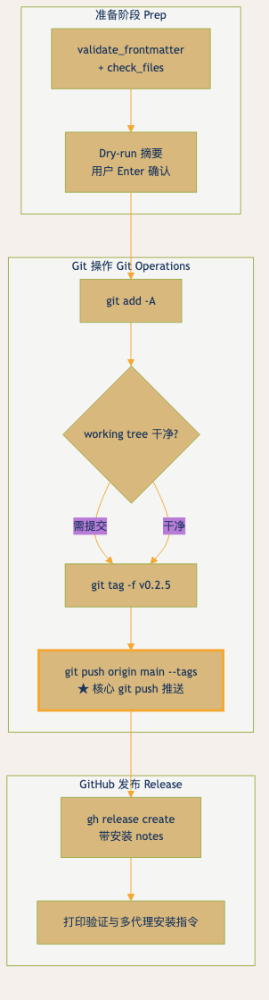

[git-push-release-workflow.html](https://github.com/user-attachments/files/28890337/git-push-release-workflow.html)# archviz-skills


Restrained information visualization skill pack for AI agents.

Every visualization starts with a **brief read** and **three dials** — not a default template.


---

## 截图素材 / Screenshot Material (v0.2.5)

**git push 发布流程 · 图文并茂示例（已 po 到主页）**



使用 Wes Anderson (Moonrise Kingdom) 暖有机配色，嵌入完整发布流程图（git push 步骤 ★ 高亮）。

**直接打开完整版（推荐用于高质量截图）**：  
[examples/git-push-release-workflow.html](examples/git-push-release-workflow.html)

自包含 HTML，Wes Anderson 调色 + 丰富中文/英文图文说明 + 命令表 + 截图提示。浏览器打开 → F11 全屏 → 直接截专业图文并茂素材。

源文件（GitHub 直接渲染 Mermaid）：  
[examples/git-push-release-workflow.mmd](examples/git-push-release-workflow.mmd)

此示例用于演示 0.2.5 darwin 自进化后的发布流程（meta）。

---

## What this is

A skill for AI agents (Claude Code, Hermes, Codex, etc.) that generates **rational, minimalist, restrained visualizations**. Not just Mermaid — supports ASCII/termaid terminal rendering, self-contained HTML, Python (Plotly), Obsidian Canvas, draw.io handoff guidance, and Three.js 3D archviz.

## Design philosophy

`archviz-skills` treats every diagram as a small **DESIGN.md artifact**: a plain-text design contract that an agent can read, execute, and audit. The goal is not to make diagrams prettier by default; the goal is to make their visual language explicit enough that another agent can reproduce the same taste without guessing.

Every output should expose five things:

| Layer | What it answers | Required evidence |
|---|---|---|
| Atmosphere | What should this feel like? | Palette + density + restraint |
| Tokens | What exact values are allowed? | Hex values, line weights, type scale |
| Components | What recurring pieces exist? | Nodes, arrows, legends, labels |
| Layout | How does information collapse? | Direction, caps, fallbacks |
| Guardrails | What must never happen? | Anti-patterns + validation gates |

This is adapted from the `awesome-design-md` pattern: `DESIGN.md` is the visual truth source, `SKILL.md` is the execution protocol, and examples prove the contract works.

**Core principles:**
- Brief-first, anti-slop
- Text-first, preview-compatible
- One accent max, contrast-checked
- Environment-aware (Obsidian / terminal / deliverables / 3D)
- Editable-handoff aware (`.drawio` guidance when Mermaid is not enough)
- Design-contract first: no template ships without tokens, intent, constraints, and validation notes

**Mode routing:**
- **Default (2D infoviz)** — charts, flowcharts, gantt, sankey, tables, teaching diagrams
- **3D archviz** — only when the brief mentions building, floorplan, structure, section cut, or walkthrough (`templates/html/threejs-*.html`)
- **Editable handoff** — use draw.io mode when the user needs a diagram that can be edited by architects, teachers, or engineering teams after generation

---

## Quick start

```bash
git clone https://github.com/archsueh/archviz-skills.git
# Claude Code / Codex
cp -r archviz-skills ~/.claude/skills/
# Hermes Agent
cp -r archviz-skills ~/.hermes/skills/creative/archviz-skills
```

---

## Structure

```
archviz-skills/
├── SKILL.md              # Execution workflow + anti-patterns
├── DESIGN.md             # Design system, Stitch 9-section format (+ Extended: taxonomy, Aver, 3D)
├── preview.html          # Visual catalog: palettes, type scale, node/edge styles
├── README.md             # This file
├── CONTRIBUTING.md       # Contribution guide
├── CHANGELOG.md          # Version history
├── LICENSE               # MIT
├── templates/
│   ├── mermaid/          # 15 .mmd templates
│   ├── ascii/            # 4 .txt templates
│   ├── html/             # 21 .html templates (incl. threejs-archviz)
│   ├── python/           # 5 .py templates
│   ├── canvas/           # 2 canvas handoff templates
│   ├── obsidian-canvas/  # 3 Obsidian Canvas templates
│   └── excalidraw/       # 1 Excalidraw template
├── examples/
│   ├── git-push-release-workflow.html  # **图文并茂截图素材**（Wes Anderson 配色，自包含 HTML，直接打开截图）
│   ├── git-push-release-workflow.mmd   # 图文并茂 git push 发布流程 (Wes Anderson variant)
│   ├── mermaid-demo.md                 # Mermaid bar + flow + gantt
│   ├── teaching-building-3d.html       # 4-floor building walkthrough
│   ├── course-admission-flow.mmd       # Teaching funnel
│   └── python-demo.py                  # Plotly scatter + line
└── references/           # Detailed rules (gantt, style, validation, draw.io, terminal routing)
```

---

## Templates

| Category | Count | Types |
|---|---|---|
| Mermaid | 15 | gantt, sankey, distribution, diverging-bar, network, architecture, scoring, intro, closed-loop, funnel, decision-matrix, state-machine, dependency-network |
| ASCII | 4 | flowchart, architecture, gantt, icon-system |
| HTML | 21 | bubble, bullet-graph, funnel, gauge, heatmap, line, radar, sunburst, treemap, waffle, waterfall, self-contained, threejs-archviz, threejs-floorplan, plus advanced chart templates |
| Python | 5 | scatter-plot, box-plot, candlestick, parallel-coordinates, viz template |
| Canvas | 6 | canvas, Obsidian Canvas, Excalidraw handoff templates |

---

## Design system

[DESIGN.md](DESIGN.md) follows the Stitch DESIGN.md 9-section format (per [awesome-design-md](https://github.com/VoltAgent/awesome-design-md)):

1. Visual Theme & Atmosphere (+ Agent-Readable Contract)
2. Color Palette & Roles — semantic names + hex + role, 5 palette systems, luminance contrast gate
3. Typography Rules (越大越细 hierarchy)
4. Component Stylings — nodes, edges, groups, gantt, tables, Mermaid init
5. Layout Principles — three dials + whitespace philosophy
6. Depth & Elevation — flat by doctrine
7. Do's and Don'ts
8. Responsive Behavior + degradation strategy
9. Agent Prompt Guide — quick color reference + ready-to-use prompts

Extended sections: visualization taxonomy (Few + Shneiderman), Aver signature patterns, 3D archviz (Three.js + animejs), draw.io handoff rules, terminal routing, scene contracts, validation gates.

[preview.html](preview.html) is the visual catalog (swatches, type scale, node/edge vocabulary) — open it in a browser.

---

## Related

### Core dependencies
- [mermaid-js/mermaid](https://github.com/mermaid-js/mermaid) — Official Mermaid
- [beautiful-mermaid](https://github.com/lukilabs/beautiful-mermaid) — 10.3k stars
- [guizang-ppt-skill](https://github.com/op7418/guizang-ppt-skill) — Swiss PPT
- [anydesign](https://github.com/archsueh/anydesign) — Design analysis

### 0.1.6 Optimization References
This release incorporates patterns from the following projects (reviewed for draw.io handoff, Drawnix/Plait support, terminal rendering, skill composition, refinement loops, etc.):

- [Agents365-ai/drawio-skill](https://github.com/Agents365-ai/drawio-skill) — Generate draw.io diagrams from natural language (presets, vision self-check, refinement, codebase-to-diagram, exports)
- [plait-board/drawnix](https://github.com/plait-board/drawnix) — Open-source whiteboard tool with mind maps, flowcharts, freehand, Markdown/Mermaid support
- [markdown-viewer/skills](https://github.com/markdown-viewer/skills) — Opinionated agent skills for diagrams and visualizations in Markdown
- [fasouto/termaid](https://github.com/fasouto/termaid) — Render Mermaid diagrams as Unicode art in terminal (18 types, themes, Python API)
- [DayuanJiang/next-ai-draw-io](https://github.com/DayuanJiang/next-ai-draw-io) — Next.js web app integrating AI with draw.io diagrams (natural language create/modify)
- [Rss3208/Visiomaster](https://github.com/Rss3208/Visiomaster) — AI visualization and diagram generation patterns

See full optimization plan and details in [CHANGELOG.md](CHANGELOG.md) (0.1.6 section).

---

## License

MIT
