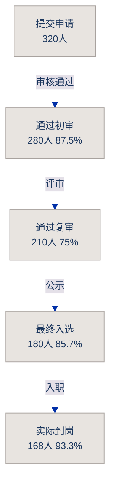

# Funnel demo · archviz-skills

Reading this as: **conversion funnel** for reviewers, restrained, Warm Paper.

```
COMPLEXITY=3  DENSITY=4  RESTRAINT=8
```

See `templates/mermaid/funnel.mmd` for the full template with ASCII fallback.



Caption: 5 阶段漏斗，初审到到岗整体留存率 52.5%，主要流失在复审环节（25%）。