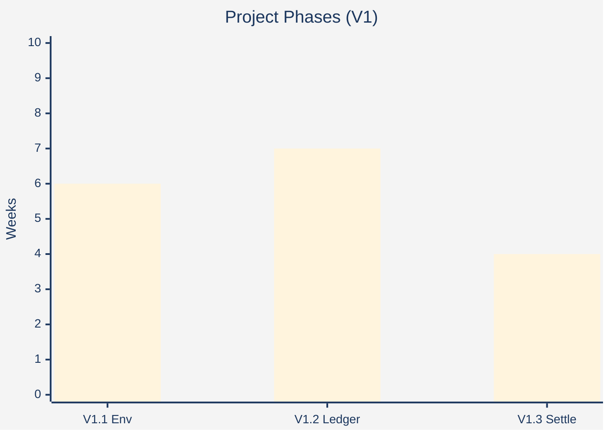

**ASCII alternative (for terminal-like in OB):**
```
Project Phases (V1)
V1.1 Env    |======|
V1.2 Ledger      |=======|
V1.3 Settle           |====|
Legend: |===| = weeks; codes for labels.
```

**Self-contained HTML (paste to OB HTML block for direct interactive browse):**
(See /templates/self-contained-html-viz.txt ; agent fills data for bar type.)

**Notes (per skill):**
- Env=OB → lightweight.
- Type from report: ranking → bar.
- Restrained: single accent #002FA7, warm paper, no junk.
- For deliverables later: run python-viz template for Plotly version.
- Author habit: direct, no filler.
```