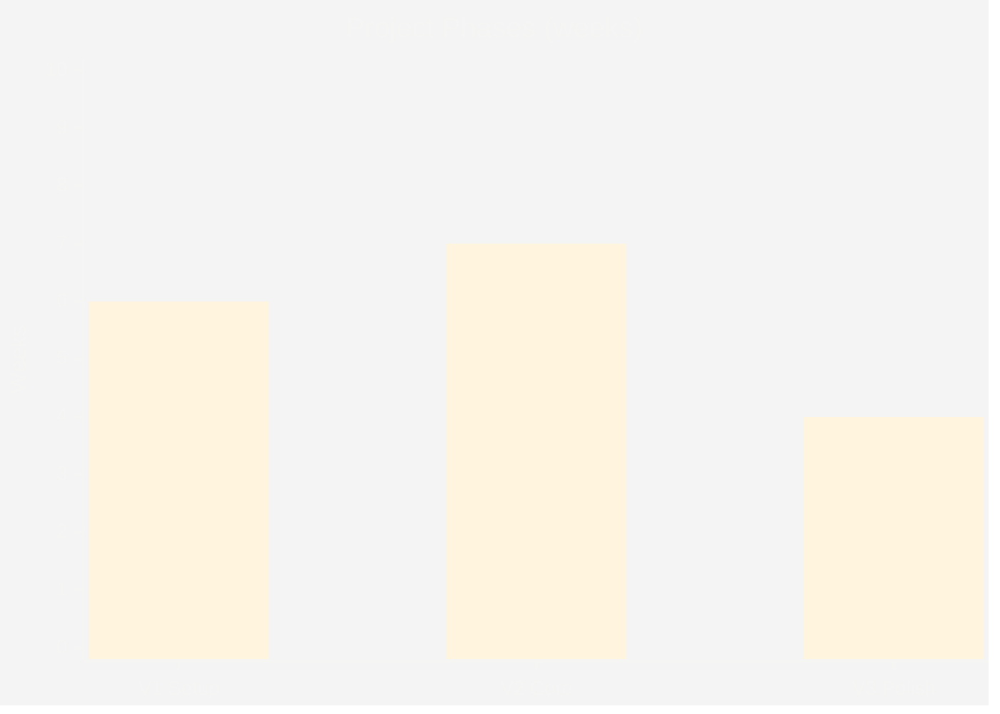
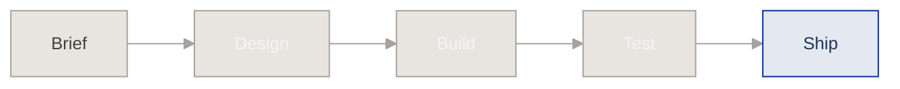
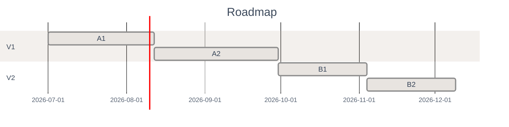

# archviz-skills Mermaid Demo

Three diagrams demonstrating restrained design in Obsidian/GitHub.

## 1. Ranking Bar

## 2. Process Flow

## 3. Gantt (codes only + table)

| Code | Task | Duration | Deliverable |
|---|---|---|---|
| A1 | Setup + Swift basics | 6w | Dev environment ready |
| A2 | Core CRUD + ledger | 7w | Working data layer |
| B1 | iCloud sync | 5w | Cloud persistence |
| B2 | Charts + export | 5w | Visual analytics |
