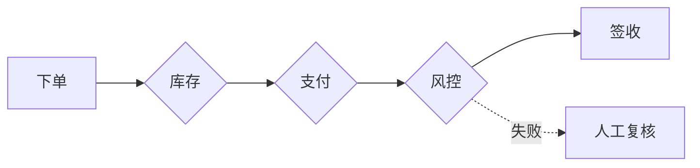

# Accessibility Contract（无障碍契约）

**Load when:** 产出任何 SVG / HTML 图表，或用户提到无障碍、screen reader、a11y、对比度、色盲、投影、印刷。

**为什么是硬契约而不是建议**：一张图对读屏软件来说不是「一张图」，而是一棵没有名字的元素树。没有契约的 SVG 会被读成「图形 图形 图形 图形」；有契约的 SVG 会被读成「组织架构图：指挥中心把工作路由给专业 agent，并指定升级责任人」。后者才是图的意义。

> **适用范围**：本契约对 **SVG / HTML 引擎**是强制的。Mermaid / ASCII 无法表达这些属性——它们的可访问性补偿见 §7。

---

## 1. 六条硬规则

### R1 — `<svg>` 必须自报身份

```svg
<svg viewBox="0 0 1200 720" role="img" aria-labelledby="pipeline-title pipeline-desc" xmlns="http://www.w3.org/2000/svg">
```

- `role="img"`：告诉辅助技术「这是一个原子图形，不要往里逐元素读」。
- `aria-labelledby`：指向本图自己的 `<title>` 和 `<desc>` 的 id，**两个都要指**。
- 缺任何一个 → 读屏软件会逐节点朗读，语义完全丢失。

### R2 — `<title>` 必须是 `<svg>` 的第一个子元素

```svg
<svg viewBox="..." role="img" aria-labelledby="pipeline-title pipeline-desc">
  <title id="pipeline-title">订单履约链路</title>   <!-- 必须在这里 -->
  <desc id="pipeline-desc">……</desc>                <!-- desc 紧随其后 -->
  <defs>…</defs>
  …
</svg>
```

**放在 `<defs>` 之后、或放在末尾，都可能被辅助技术忽略。** 顺序是规范要求，不是风格偏好。

### R3 — id 必须按「图名 + 变体」加前缀

| ✅ 正确 | ❌ 禁止 |
|---|---|
| `pipeline-title` / `pipeline-desc` | `title` / `desc` |
| `pipeline-dark-title` | `svg-title-1` |

**原因**：一个页面里内联两张图，裸 id `title` 会重复。浏览器取第一个匹配项——第二张图会被读成第一张图的名字。这是最隐蔽的一类无障碍缺陷，因为视觉上完全看不出来。

前缀 slug 与文件名一致（`pipeline.html` → `pipeline-title`）。

### R4 — `<title>` 是短名，≤60 字

`<title>` ≈ 页面的 `<h1>`。写主题名，不是句子。

```svg
<!-- ✅ -->
<title id="pipeline-title">订单履约链路</title>
<!-- ❌ 太长，读屏会念半分钟 -->
<title id="pipeline-title">订单履约链路图展示了从用户下单开始经过库存校验支付网关风控审核仓储拣货物流配送直到签收的完整流程</title>
```

### R5 — `<desc>` 描述**内容**，不描述**几何**

一句话说清「没有这张图，读者需要知道什么」。**绝不要逐形状念坐标。**

```svg
<!-- ✅ 描述内容 -->
<desc id="pipeline-desc">订单从下单到签收的主路径经过库存、支付、风控三道校验，风控失败会旁路到人工复核队列。</desc>

<!-- ❌ 描述几何 —— 比没有描述更糟 -->
<desc id="pipeline-desc">上方一个矩形，下方五个矩形，矩形之间用箭头连接。</desc>
```

判断标准：把这句话念给一个看不到图的人听，他能否复述这张图想传达的信息？不能就重写。

### R6 — 纯装饰图形用 `aria-hidden="true"`

图标、纹理、装饰性分隔线、dot pattern：

```svg
<svg aria-hidden="true" focusable="false">…</svg>
```

**不要给装饰图形加 `role="img"`**——那等于给读屏软件增加噪音。装饰就是装饰。

---

## 2. 对比度（G2 门禁的一部分）

| 场景 | 最低要求 |
|---|---|
| 正文 / 节点名（≥13px） | WCAG AA：对比度 ≥ **4.5:1** |
| 小字 / sublabel（≤11px） | 提到 ≥ **7:1**（小字更难读，AA 不够） |
| 非文本图形（箭头、边框、区分性色块） | ≥ **3:1** |

计算（相对亮度比，不要用亮度阈值近似）：

```python
def _lin(c):
    c = c / 255
    return c / 12.92 if c <= 0.04045 else ((c + 0.055) / 1.055) ** 2.4

def rel_lum(hexcolor):
    r, g, b = (int(hexcolor[i:i+2], 16) for i in (1, 3, 5))
    return 0.2126 * _lin(r) + 0.7152 * _lin(g) + 0.0722 * _lin(b)

def contrast(a, b):
    la, lb = rel_lum(a), rel_lum(b)
    hi, lo = max(la, lb), min(la, lb)
    return (hi + 0.05) / (lo + 0.05)
```

> ⚠️ SKILL.md QUICK REFERENCE 里的 `luminance(0.299R+0.587G+0.114B) < 128` 是**快速判明暗**用的近似式，**不能用来判定是否通过 AA**。它没有做 sRGB 线性化，也不产生比值。要判合规必须用上面的 `contrast()`。

**`scripts/self_check.py` 已内置此计算**，见 §5。

---

## 3. 色盲安全（不靠颜色单通道）

**绝不**只用红/绿区分含义。每个语义维度至少给两个通道：

| 单通道（❌） | 双通道（✅） |
|---|---|
| 红=失败 绿=成功 | 红=失败 + 虚线边框 + 叉号标签 |
| 深浅色阶表示数值 | 色阶 + 直接标注数值 |
| 颜色区分箭头类型 | 颜色 + 实线/虚线/点线 |

**灰度测试**：把图转成灰度，如果信息还能读出来，就通过了。8% 的男性有红绿色盲——这不是边缘情况。

---

## 4. 动效与 reduced motion

若产出带动效的 HTML：

1. **静态优先**：`prefers-reduced-motion: reduce` 下必须显示**完整静态帧**（不是空白、不是第一帧），并隐藏或禁用播放控件。
2. **不依赖 JS 表达含义**：禁用 JS 后，图的完整含义仍然可读。
3. **动效不增加信息量**：动画只做「按顺序揭示」，不得引入静态图中不存在的含义。

```css
@media (prefers-reduced-motion: reduce) {
  .archviz-animated { animation: none !important; transition: none !important; }
  .archviz-playback-controls { display: none !important; }
}
```

---

## 5. 自动校验

```bash
# 单个文件
python3 scripts/self_check.py output/diagram.html

# 批量
python3 scripts/self_check.py --all examples/ templates/

# 只跑 a11y 分类
python3 scripts/self_check.py --only a11y output/diagram.html

# 输出 JSON（接 CI）
python3 scripts/self_check.py --json output/diagram.html
```

`self_check.py` 的 `a11y` 分类检查：

| 检查 | 判定 |
|---|---|
| `role="img"` 存在 | 缺失 → FAIL |
| `aria-labelledby` 存在且 id 可解析 | 悬空引用 → FAIL |
| `<title>` 是 `<svg>` 第一个子元素 | 位置错误 → FAIL |
| `<title>` / `<desc>` 非空且 ≤60 / ≤200 字 | 空或超长 → FAIL |
| id 是否裸用 `title` / `desc` | 裸用 → FAIL |
| `desc` 是否像几何描述（含「矩形/圆形/上方/下方」等） | 命中 → WARN |
| 装饰 svg 是否有 `aria-hidden` | 无 `title` 的 svg 且无 `aria-hidden` → WARN |

退出码：`0` 全通过 · `1` 有 FAIL · `0` + stderr 警告（WARN 不影响退出码，可用 `--strict` 提升为 FAIL）。

---

## 6. 与现有门禁的关系

| 门禁 | 关系 |
|---|---|
| **G2 Tokens** | 对比度检查是 G2 的一部分，现在有了精确算法（§2） |
| **G5 Validate** | a11y 校验并入 G5；`self_check.py` 是它的可执行实现 |
| **G6 Embed** | 内联到 Obsidian / 网页时，R3 的 id 前缀保证多图共存 |

**Iron rule 追加一条**：SVG/HTML 引擎的产出，**没有 a11y 契约不算通过 G5**。Mermaid/ASCII 走 §7 补偿。

---

## 7. Mermaid / ASCII 的补偿策略

这两个引擎无法表达 ARIA。补偿方式：

1. **图外补一层可访问文本**——在 Mermaid 代码块前后各加一段说明。图本身读不了，但语义不丢：

```markdown
订单履约链路包含三道校验（库存 → 支付 → 风控），风控失败旁路到人工复核。


```

2. **优先产出 SVG/HTML 版作为主交付物**，Mermaid 作为可粘贴的轻量版本。若 brief 对无障碍有要求，直接走 HTML 引擎。
3. **ASCII 版本本身是可访问的**——纯文本，读屏软件读得出来。这是 ASCII fallback 的一个额外好处，不只是「预览兼容」。

---

## 8. 检查清单

产出 SVG/HTML 图表前：

- [ ] `<svg>` 有 `role="img"` 且 `aria-labelledby` 同时指向 title 和 desc？
- [ ] `<title>` 是 `<svg>` 的**第一个子元素**，在 `<defs>` 之前？
- [ ] id 带图名 slug 前缀？全文件无裸 `title` / `desc`？
- [ ] `<title>` ≤60 字、是短名不是句子？
- [ ] `<desc>` 说的是**内容**不是几何？念给盲人听能复述吗？
- [ ] 装饰图形有 `aria-hidden="true"` 且没有多余的 `role="img"`？
- [ ] 正文对比度 ≥4.5:1、小字 ≥7:1、非文本 ≥3:1？（用 `contrast()` 真算，不用亮度近似）
- [ ] 灰度下信息仍完整？（没有只靠红绿单通道）
- [ ] 有动效时，reduced-motion 显示完整静态帧且隐藏控件？
- [ ] `python3 scripts/self_check.py <file>` 退出码为 0？
