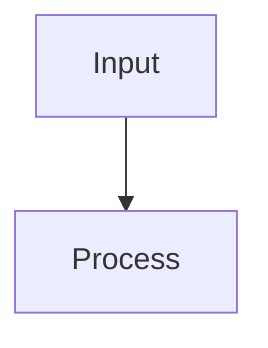

# archviz ASCII Generation Workflow

**Core principle**: Mermaid (or structured data) is the single source of truth.  

**Hard Rule (CLI default for agents)**: For all agent-driven ASCII generation, CLI tools are the default and preferred path. Agents must use local CLI binaries (go install, brew, npm, etc.) for automation, repeatability, and full scriptability. Web tools are explicitly avoided to keep workflows agent-native and offline-capable. Everything downstream (termaid preview, optional CLI enhancement, plain fallback) exists only for different consumption environments.

## The Pipeline (always in this order)

1. **Brief + Dials**  
   Decide if ASCII is needed at all (terminal, plain-text docs, fallback for uncertain envs).

2. **Generate Source**  
   - Prefer Mermaid (flowchart, architecture-beta, gantt, etc.).  
   - Or direct structured text for simple cases.  
   - Apply tokens, typography, and anti-slop rules from DESIGN.md and SKILL.md §6–7.

3. **Primary Terminal Preview**  
   Use termaid (see `references/termaid-routing.md`):
   ```bash
   termaid diagram.mmd --theme mono --width 100
   termaid diagram.mmd --ascii --width 80   # conservative / CI
   ```
   Validate layout, overflow, contrast in actual terminal.

4. **Optional Enhancement (Presentation / Decorative only)**  
   - For fancy banners, image-derived art, or other decorative styles when explicitly requested in the brief.  
   - Feed into a pure CLI tool (see `references/ascii-cli-alternatives.md`). This keeps the entire pipeline agent-native and scriptable.  
   - Capture output and treat it as **derived artifact**, never the source of truth.  
   - Examples: go-figure, figlet + xero fonts, ascii-image-converter.

5. **Plain ASCII Fallback (mandatory when ASCII is delivered)**  
   - Always include a max-80-column, no-box-drawing version.  
   - Use or adapt content from `templates/ascii/` (flowchart, architecture, gantt, icon-system).  
   - This version must survive: `cat`, GitHub diffs, non-mono fonts, chat clients, copy-paste.

6. **Self-healing + Validation (G5)**  
   - Render termaid + plain fallback.  
   - Check: labels clipped? overflow? box-drawing slipped in?  
   - Fix source first, then re-render derivatives.  
   - Never ship without the plain fallback if the environment is unknown.

7. **Embed + Caption (G6)**  
   Caption explains the finding, not just the diagram.  
   Mention which variants are available:
   > "Mermaid source + termaid preview + plain ASCII fallback. Enhanced figlet banner available on request."

## Decision Matrix

| Target Environment          | Required Output                          | Optional Enhancement |
|-----------------------------|------------------------------------------|----------------------|
| Terminal / SSH / CI logs    | termaid (mono or --ascii) + plain ASCII | No                   |
| Obsidian / Markdown docs    | Mermaid source + plain ASCII fallback   | Figlet banner only   |
| Presentation / README hero  | Mermaid + termaid + plain + CLI fancy   | Yes (go-figure / figlet) |
| Image reference available   | Plain ASCII + (optional) ascii-image-converter | Yes             |
| Unknown / maximum survivability | Plain ASCII only (80 col)             | No                   |

## Example Deliverable Structure (in .md)

```markdown
### System Flow



**Terminal preview** (run `termaid flow.mmd --theme mono`):

[rendered termaid output here]

**Plain ASCII fallback** (guaranteed compatible):

```
[Input] --> [Process]
```

**Presentation banner** (optional, generated with `go-figure "System Flow" --font big`):

[ big ASCII text ]
```

## Anti-Patterns

- Hand-drawing fancy ASCII first instead of starting from Mermaid/structure.
- Using box-drawing characters in the plain fallback.
- Shipping only the CLI-enhanced version and omitting the plain fallback.
- Treating CLI output as editable source (it is derived).
- Exceeding 80 columns in any fallback layer.

## Integration with Existing References

- `references/termaid-routing.md` — primary terminal path
- `references/ascii-cli-alternatives.md` — approved CLI tools + install/usage
- `templates/ascii/` — canonical plain templates (always start here for fallback)
- DESIGN.md — strict ASCII rules (no box-drawing, 80-col cap, restraint)
- SKILL.md §11 (Terminal Rendering) + §5 (Degradation strategy)

## Maintenance

When adding a new CLI tool:
1. Add it to `references/ascii-cli-alternatives.md` with install + example.
2. Update this workflow if the usage pattern changes.
3. Optionally add a minimal example to `templates/ascii/`.
4. Run the usual G5 validation on any diagrams that now use the new tool.

This workflow guarantees that archviz ASCII output remains **restrained, source-traceable, and environment-resilient**.