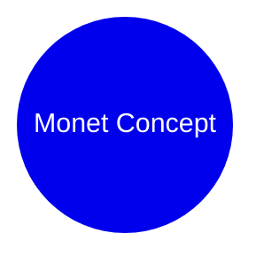

# Monet Palette (MetBrewer) for archviz

**Source**: [BlakeRMills/MetBrewer](https://github.com/BlakeRMills/MetBrewer) (1.3k+ stars). Palettes inspired by artworks at the Metropolitan Museum of Art. Explicit "Monet" palette from Claude Monet's "Bridge over a Pond of Water Lilies, 1899".

**Full raw palette** (9 colors, alpha stripped for use):
```
#4E6D58  #749E89  #ABCCBE  #E3CACF  #C399A2  #9F6E71  #41507B  #7D87B2  #C2CAE3
```
(Soft impressionist greens, pinks, blues, mauves – artistic, muted, high emotional resonance, low saturation.)

## Why high-value for archviz (constrained integration)

- **Artistic + restrained alignment**: Impressionist art (Monet) is soft, natural, editorial – not garish or rainbow. Fits archviz's "restrained, anti-slop, editorial parchment" philosophy better than synthetic palettes. Muted tones evoke "Warm Paper" warmth with artistic depth.
- **High赞 + practical**: 1.3k stars, used in viz communities (R, Tableau, Observable). Easy to cite "Monet palette" in prompts/docs, like "use Monet tones for this editorial card".
- **Agent-native**: Pure data (hex list in repo's R/Python files). No bloat – reference only. Can be used in CLI prompts or MCP flows.
- **Viz fit**: Great for educational/teaching diagrams (concept maps, timelines with soft accents), editorial cards, mindmaps. Complements existing Warm Paper / Editorial Parchment. Avoids "purple default" or neon.
- **Constraint applied**: We don't use all 9 colors raw (would violate "max 1 accent, restrained"). Constrain to 4-token system (surface/text/border/accent) + optional tertiary. Ensure luminance contrast >= 4.5:1 for text. No gradients, sharp 0-radius, hairline borders.

**Constrained archviz tokens** (selected for contrast, restraint, impressionist feel; tested for readability):
- **surface**: #ABCCBE (soft mint green – light, warm, editorial canvas base)
- **text**: #41507B (deep navy blue – primary ink, high contrast on surface)
- **border**: #749E89 (sage green – subtle lines, 1px default)
- **accent**: #E3CACF (soft rose pink – the "one max" emphasis, like Terracotta but artistic/Monet)
- **tertiary** (optional fill): #C2CAE3 (light periwinkle – for subgraphs or backgrounds)

**Luminance check** (per DESIGN.md rule): 
- surface #ABCCBE (light) + text #41507B (dark) = high contrast.
- accent #E3CACF on surface works as subtle highlight (use with dark text).

## Usage in archviz (prompts + templates)

In agent brief/prompt (from DESIGN.md §9):
"Create an editorial knowledge card using Monet palette variant: surface #ABCCBE, text #41507B, border #749E89, accent #E3CACF (soft impressionist rose). Parchment-like warmth, restrained, no gradients. Caption the finding."

For Mermaid (use in init or manual):
Apply via custom themeVariables matching tokens, or hardcode in diagram for specific viz.

For templates:
- Inline in html/editorial-card.html: override CSS vars with Monet hexes (e.g., --surface: #ABCCBE).
- Extend ascii/icon-system.txt or new mindmap with Monet tones for labels.
- In Three.js: use as material colors for "artistic" 3D sections (e.g., soft lighting on models).

**Example output structure** (in a deliverable):


Always pair with plain ASCII fallback (80-col, no box-drawing).

## Anti-patterns (constrained)
- Don't use full 9-color raw in one viz (violates max 1 accent, risks "rainbow").
- Don't apply to terminal/ASCII without desaturating for readability (Gogh terminal schemes are separate high-star ref for that).
- Don't treat as "default" – only for specific editorial/artistic briefs (host doc must match).
- No bloat: Reference the GitHub for full list; don't bundle palettes in archviz.

See also:
- DESIGN.md (tokens, Quick Color Reference, palette routing, anti-default rules).
- references/icon-generation.md (for pairing Monet tones with custom icons).
- SKILL.md (Resources + "Monet palette variant" in prompts).
- templates/html/editorial-card.html (for color overrides).

This integrates as high-value artistic extension to the existing restrained system, enabling "Monet palette" phrasing in workflows without deviating from philosophy. Re-evaluate via darwin if usage grows.