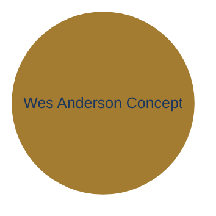

# Wes Anderson Palette (Moonrise Kingdom) for archviz

**Source**: EmilHvitfeldt/r-color-palettes (1.7k+ stars) + karthik/wesanderson. Iconic film-derived palettes from Wes Anderson movies. "Moonrise Kingdom" (2012) is the warm organic exemplar: deliberate, memorable, restrained composition with strong design identity — not random hexes, but crafted visual storytelling.

**Full raw palette** (Moonrise1, 5 colors):
```
#d6929c  #9eae4c  #f4a731  #ffc81d  #d8b87c
```
(Warm peach-rose, sage green, terracotta orange, golden yellow, soft beige — earthy, nostalgic, high emotional resonance, low-to-mid saturation. 60-30-10 friendly: dominant warm neutrals, secondary greens/beiges, single warm accent.)

## Why high-value for archviz (constrained integration)

- **Strong design sense + huashu alignment**: Wes Anderson palettes are famous for "design感很强" — iconic, intentional, filmic restraint (one dominant temperature + precise accents, no slop). Directly echoes huashu-design/huashu-md-html rules: 60-30-10, Warm Trust preset (#FDF6EC bg + #E17055 terracotta accent), one accent (rust/墨绿/深红), warm organic low-sat, editorial/Swiss clarity, anti-AI-purple-gradient. Moonrise Kingdom's peach/terracotta + sage + beige is warm paper + terracotta territory.
- **High赞 + practical**: 1.7k+ stars in r-color-palettes; the wesanderson package is a classic in viz communities (R, ggplot, Observable, design refs). Easy to cite "Wes Anderson palette (Moonrise Kingdom)" in prompts like "Monet palette variant".
- **Agent-native**: Pure hex data from repos (R/Python/JSON). No bloat — reference only. Works in CLI prompts, MCP, or templates.
- **Viz fit**: Excellent for editorial cards, teaching diagrams, warm organic briefs (concept maps, timelines, knowledge artifacts). Complements Warm Paper / Editorial Parchment + Terracotta. Avoids neon/rainbow; adds artistic character while staying restrained.
- **Constraint applied**: Full 5 colors raw would violate "max 1 accent, restrained". Constrain to archviz 4-token system (surface/text/border/accent) + optional tertiary. Luminance contrast enforced. No gradients, sharp corners, hairline borders. Matches huashu 60% bg / 30% text-shapes / 10% accent.

**Constrained archviz tokens** (selected for contrast, restraint, warm organic + huashu Warm Trust echo; tested for readability):
- **surface**: #d8b87c (warm beige — light, paper-like canvas base, close to huashu Warm Trust #FDF6EC)
- **text**: #1B365D (deep navy / Ink Navy — primary ink from archviz philosophy; high contrast on warm surface; or #3D3D3D for softer)
- **border**: #9eae4c (sage green — subtle lines, 1px default; the "墨绿" warmth)
- **accent**: #f4a731 (warm terracotta orange — the single 10% emphasis; echoes huashu #E17055 rust and archviz Editorial Terracotta #c96442)
- **tertiary** (optional fill): #d6929c (soft peach-rose — for subgraphs or muted highlights only)

**Luminance check** (per DESIGN.md rule): 
- surface #d8b87c (light warm) + text #1B365D (dark) = high contrast.
- accent #f4a731 on surface works as the one warm cue (use with dark text).
- border sage stays hairline, never competes with accent.

## Usage in archviz (prompts + templates)

In agent brief/prompt (from DESIGN.md §9, extend the Monet example):
"Create an editorial knowledge card using Wes Anderson palette variant (Moonrise Kingdom): surface #d8b87c warm beige, text #1B365D deep navy, border #9eae4c sage, accent #f4a731 terracotta orange (the single 10% emphasis). Warm organic, 60-30-10 restraint, huashu Warm Trust echo, no gradients. Caption the finding."

For Mermaid (use in init or manual):
Apply via custom themeVariables matching tokens, or hardcode in diagram for specific viz.

For templates:
- Inline in html/editorial-card.html: override CSS vars with these hexes (e.g., --surface: #d8b87c; --accent: #f4a731).
- Extend ascii/icon-system.txt or new mindmap/flowchart with Wes tones for labels (desaturate slightly for terminal readability).
- In Three.js: use as material colors for warm organic 3D sections (soft lighting on models, one accent highlight).

**Example output structure** (in a deliverable):


Always pair with plain ASCII fallback (80-col, no box-drawing).

## Anti-patterns (constrained)

- Don't use full 5-color raw in one viz (violates max 1 accent, risks "color as decoration").
- Don't apply bright yellow #ffc81d as second accent — lock to one (the terracotta/orange).
- Don't treat as "default" — only for specific artistic/educational/warm-organic briefs (host doc must match or user requests "Wes Anderson tones").
- No bloat: Reference the GitHub (EmilHvitfeldt/r-color-palettes or karthik/wesanderson) for full film sets; don't bundle palettes in archviz.
- Terminal/ASCII: desaturate or fall back to Gogh Gruvbox schemes (separate high-star ref) for readability.

See also:
- DESIGN.md (tokens, Quick Color Reference, palette routing, anti-default rules, 60-30-10 spirit).
- references/monet-palette.md (sister artistic variant — cooler impressionist; this one is warmer organic).
- SKILL.md (Resources + "Wes Anderson palette variant" phrasing).
- templates/html/editorial-card.html (for color overrides).
- huashu-design design-principles.md (60-30-10 + Warm Trust terracotta as direct aesthetic source).

This integrates as the high-value "strong design sense" extension (Wes Anderson's crafted visual identity + huashu warm restraint), enabling "Wes Anderson palette (Moonrise Kingdom)" phrasing in workflows without deviating from archviz philosophy. Re-evaluate via darwin if usage grows. Prior Monet was soft museum; this adds warm filmic character.